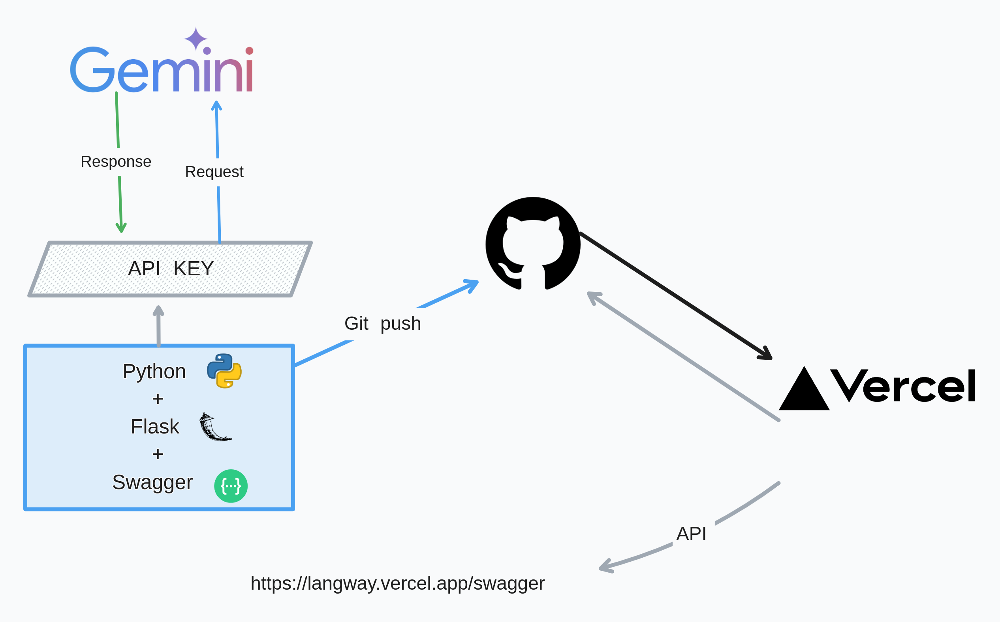

<!--  -->

<a name="lang_way">
    
</a>

[![Contributors][contributors-shield]][contributors-url]
[![Forks][forks-shield]][forks-url]
[![Stargazers][stars-shield]][stars-url]
[![personal][personal-shield]][personal-url]
[![Issues][issues-shield]][issues-url]
[![LinkedIn][linkedin-shield]][linkedin-url]


<!-- .png) -->


<!-- PROJECT LOGO -->
<br />
<div align="center">

  <h3 align="center">Lang Way</h3>

  <p align="center">
    Backend application developed for the 'Imersão AI' challenge by Alura in partnership with Google.
    <br />
    <a href="https://github.com/luk3mn/lang_way/README.md"><strong>Explore the docs »</strong></a>
    <br />
    <br />
  </p>
</div>


<!-- TABLE OF CONTENTS -->
<details>
  <summary>Table of Contents</summary>
  <ol>
    <li>
      <a href="#about-the-project">About The Project</a>
      <ul>
        <li><a href="#built-with">Built With</a></li>
      </ul>
    </li>
    <li>
      <a href="#getting-started">Getting Started</a>
      <ul>
        <li><a href="#prerequisites">Prerequisites</a></li>
        <li><a href="#installation">Installation</a></li>
      </ul>
    </li>
    <li><a href="#usage">Usage</a></li>
    <!-- <li><a href="#deploy">Deploy</a></li> -->
    <li><a href="#roadmap">Roadmap</a></li>
    <li><a href="#license">License</a></li>
    <li><a href="#authors">Authors</a></li>
    <li><a href="#feedback">Feedback</a></li>
    <li><a href="#acknowledgments">Acknowledgments</a></li>
  </ol>
</details>


<!-- ABOUT THE PROJECT -->
## About The Project
This is an application that utilizes Generative AI based on Google's GEMINI model, aimed at providing users with guidance regarding their proficiency level in a specific foreign language. The application functions as follows: provide a text written by yourself in the language you wish to evaluate in the 'prompt' input field, and indicate the desired language in the 'language' input field. The application will then return your current level in the language, along with highlights and suggestions for improvement.
<!-- IMAGE (OPCIONAL) -->


<p align="justify">

</p> 

<p align="right">(<a href="#lang_way">back to top</a>)</p>

### Built With

Write here

* [![Python][Python]][Python-url]
* [![Flask][Flask]][Flask-url]

<p align="right">(<a href="#lang_way">back to top</a>)</p>


<!-- GETTING STARTED -->
## Getting Started

Here are some important topics about this project and how to replay it.

### Prerequisites

* [API Key from Google AI Studio](https://empresas.alura.com.br/e3t/Ctc/I8+113/d2z6gD04/VVz2CP5T59XZW3W8W7f6nGp2TW33LWhB5dXJRXN26s6063qgyTW6N1vHY6lZ3pSW5L1nmB3MbPmwW3sWbMx519LgtVdsgWL2bKcyPVWDZWQ77rXw8W2h5jYy4gdKzjVvdc4g5j0MnqV9t9Xp18DGJQW3ZZHB94-QwVXW4_kt_S4mCHlMW6jGZRl1HyXVcW4G8vBP1f20Z8N3_jGtKf8mLqVMbQj71c3D8NW7qJbnB6W6Sd9V1zfP84ZbgWzW3Hhwsf7dh2-YW2P58l_7M9b70W5dLh2b54tGTnW9g7Txc1pTfwKW50mMpD3jGHQ4W7X6GNj9lMB_HVLkMYT8GmlRNf96tBNK04)

### Installation

_Before starting this application in your local environment, it'll be necessary to proceed with some tasks to reproduce this project._

1. Clone the repo
   ```sh
   git clone https://github.com/luk3mn/lang_way.git
   ```
2. Dependencies
  ```sh
  pip3 freeze -r requirements.txt
  ```


<p align="right">(<a href="#lang_way">back to top</a>)</p>


<!-- USAGE EXAMPLES -->
<!-- ## Usage -->

<!-- Deploy -->
## Deploy
* [Lang Way](https://langway.vercel.app/swagger)

<!-- ROADMAP -->
## Roadmap

- [x] Google Gemini API
- [x] Project structure
- [x] POST /check
- [x] Swagger implementation


<p align="right">(<a href="#lang_way">back to top</a>)</p>


<!-- LICENSE -->
## License

Distributed under the MIT License. See `LICENSE.txt` for more information.

<p align="right">(<a href="#lang_way">back to top</a>)</p>


## Authors

- username: [@luk3mn](https://www.github.com/luk3mn)

## Feedback

If you have any feedback, please reach out to us at lucasnunes2030@gmail.com

> Project Link: [https://github.com/luk3mn/lang_way](https://github.com/luk3mn/lang_way)

<p align="right">(<a href="#lang_way">back to top</a>)</p>


<!-- ACKNOWLEDGMENTS -->
## Acknowledgments
* [Alura](https://www.alura.com.br/)
* [Google Gemini](https://deepmind.google/technologies/gemini/#gemini-1.5)
* [Flask Python- Swagger for rest apis](https://diptochakrabarty.medium.com/flask-python-swagger-for-rest-apis-6efdf0100bd7)


<p align="right">(<a href="#lang_way">back to top</a>)</p>


<!-- MARKDOWN LINKS & IMAGES -->
<!-- https://www.markdownguide.org/basic-syntax/#reference-style-links -->
[contributors-shield]: https://img.shields.io/github/contributors/luk3mn/lang_way.svg?style=for-the-badge
[contributors-url]: https://github.com/luk3mn/lang_way/graphs/contributors
[issues-shield]: https://img.shields.io/github/issues/luk3mn/lang_way.svg?style=for-the-badge
[issues-url]: https://github.com/luk3mn/lang_way/issues
[forks-shield]: https://img.shields.io/github/forks/luk3mn/lang_way.svg?style=for-the-badge
[forks-url]: https://github.com/luk3mn/lang_way/network/members
[stars-shield]: https://img.shields.io/github/stars/luk3mn/lang_way.svg?style=for-the-badge
[stars-url]: https://github.com/luk3mn/lang_way/stargazers
[license-shield]: https://img.shields.io/github/license/othneildrew/Best-README-Template.svg?style=for-the-badge
[license-url]: https://github.com/luk3mn/lang_way/blob/master/LICENSE
[linkedin-shield]: https://img.shields.io/badge/-LinkedIn-black.svg?style=for-the-badge&logo=linkedin&colorB=555
[linkedin-url]: https://www.linkedin.com/in/lucasmaues/
[personal-shield]: https://img.shields.io/static/v1?label=Alura&message=AI&color=blue&style=for-the-badge&colorB=555
[personal-url]: https://www.rocketseat.com.br/

<!-- Stack Shields -->
[Python]: https://img.shields.io/badge/Python-3776AB?style=for-the-badge&logo=python&logoColor=ffffff
[Python-url]: https://www.python.org/
[Flask]: https://img.shields.io/badge/Flask-000000?style=for-the-badge&logo=flask&logoColor=ffffff
[Flask-url]: https://flask.palletsprojects.com/en/3.0.x/